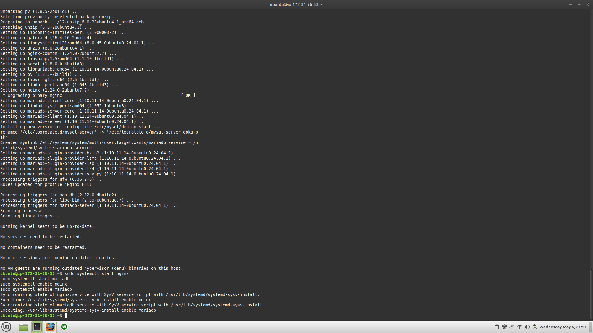
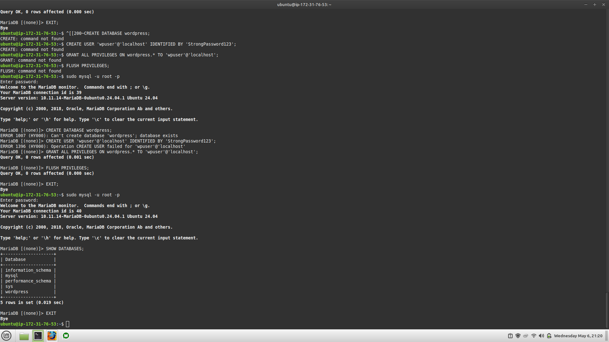
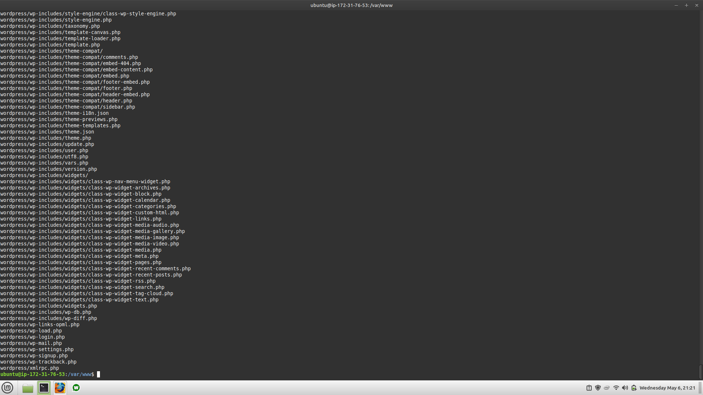
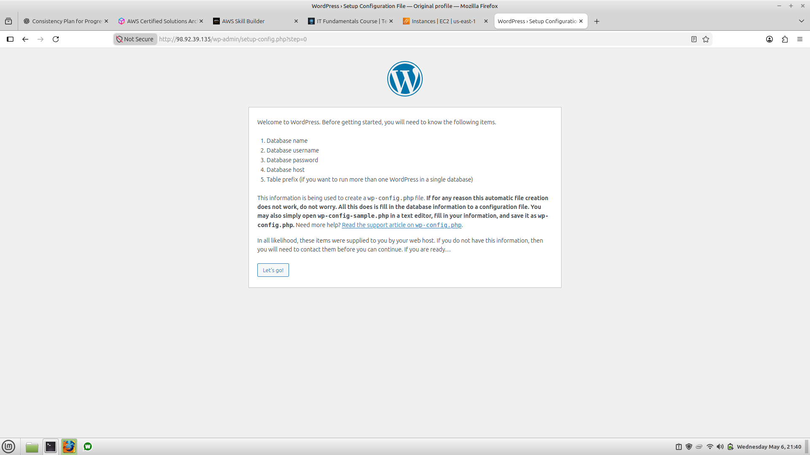

# WordPress Production Server Setup

## Project Overview
This project demonstrates the deployment of a production-style WordPress environment on Ubuntu Linux using NGINX, PHP-FPM, and MariaDB.

The objective of this project is to gain hands-on experience in Linux server administration, web server configuration, database setup, and WordPress deployment.

---

## Technologies Used

- Ubuntu Linux
- AWS EC2
- NGINX
- PHP-FPM
- MariaDB
- WordPress

---

## Features

- Configured NGINX web server
- Installed and configured PHP-FPM
- Created and configured MariaDB database
- Deployed WordPress application
- Configured virtual host
- Tested web server functionality

---

## Project Architecture

Client Browser
↓
NGINX Web Server
↓
PHP-FPM
↓
MariaDB Database

---

## Setup Steps

### 1. Server Preparation
- Updated Ubuntu packages
- Installed required dependencies

### 2. Web Server Configuration
- Installed NGINX
- Enabled and started NGINX service

### 3. PHP Installation
- Installed PHP-FPM and PHP modules
- Verified PHP processing

### 4. Database Setup
- Installed MariaDB server
- Created WordPress database and user

### 5. WordPress Deployment
- Downloaded latest WordPress package

## Screenshots

## 📸 Screenshots

**1. NGINX Homepage**

**2. MariaDB Configuration**

**3. WordPress Setup Page**

**4. WordPress Configuration - Step 1**

**5. WordPress Configuration - Step 2**

**6. WordPress Configuration - Step 3**

**7. WordPress Configuration - Step 4**

**8. WordPress Configuration - Step 5**

**9. WordPress Final Dashboard**

